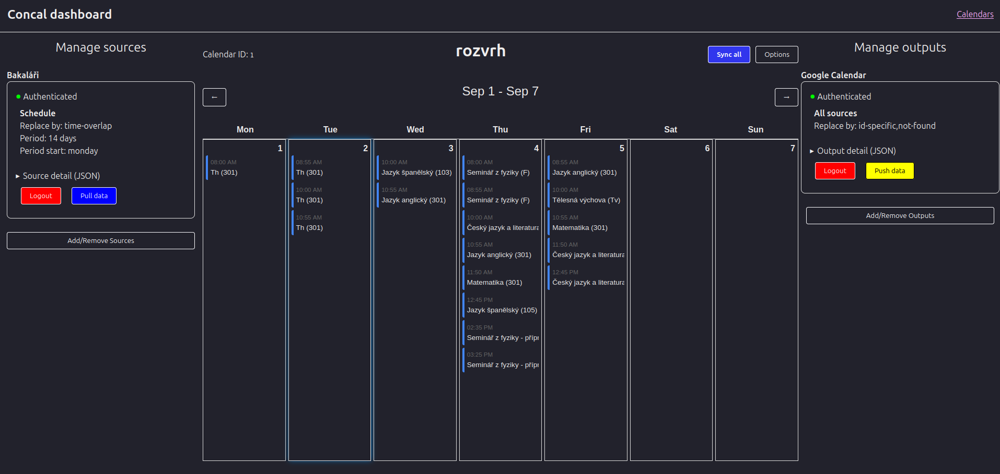

# Concal

> [!NOTE]
> This tool was replaced by: [Bakaláři iCal connector](https://github.com/panjohnny/ical-bakalari)

_Connecting stuff to your calendar since today!_



Concal is a tool designed to synchronize various data sources with your calendar. The main motivation behind this
project is to have everything in one place - consolidating events, tasks, and reminders from multiple sources into your
preferred calendar application.

## Features

- Integration with Bakaláři service
- Integration with Google Calendar

## Prerequisites

- Node.js
- npm
- vite

## Setup

1. Clone the repository or download archive from GitHub and extract it somewhere, where you can find it.
2. Open terminal in the directory.
3. Run `npm install` in order to install dependencies
4. Rename .env.dist to .env. Windows: `move .env.dist .env`, UNIX: `mv .env.dist .env`
5. See [Integration setup](#integration-setup)
6. Run `vite build`
7. If everything is ok, you should be able to run it!

## Running it

For Windows run the Concal.bat file, for Linux run Concal.sh. The adress and url should be displayed in terminal.
Default is [localhost:58009](http://localhost:58009), for development: localhost:5173.

> [!NOTE]
> Keep in mind that the server needs to run all the time the synchronization is requested, else the tasks/cron jobs will
> fail.

### Scheduling

It is possible to generate scripts that will synchronize selected calendar. In order to do that open the program in your
browser. Go to the screen where you see your calendar, click on options and select your os from the list. Then follow
your os specific provided manual.

## Integration setup

### Google Calendar

1. You need to create a project in the Google developer console and enable the Google calendar
   API. [Click here for a shortcut](https://console.cloud.google.com/flows/enableapi?apiid=calendar-json.googleapis.com)
2. Next configure OAuth. Fill in app information (write in something like Calendar sync), then enter your own email into
   the fields. Keep your project in testing and internal. Do not add any
   scopes. [Click here for a shortcut](https://console.cloud.google.com/auth/branding)
3. Create an oauth client. Under application type select desktop app. Fill in te requested fields and hit
   create. [Click here for a shortcut](https://console.cloud.google.com/auth/clients)
4. Edit the .env file in this directory, or create a new one with the following content:

```dotenv
GCAL_CLIENT_ID="**********************"
GCAL_CLIENT_SECRET="GOCSPX-**********************"
```

5. Fill in the fields with your own client id and client secret provided by the google cloud console and save the file.
6. You are done, just test it out by creating a calendar and adding a google calendar output - it is straight forward.
   Then login and connect your account.

## Integrating with other stuff

### API

See server.js

### sources and outputs

Please see src/sources and src/outputs. You may use src/sdk.js. If you use the same format and add your source to
sources.js or output to outputs.js, you should see it in UI. I recommend running in with npm run dev for development
purposes in order to have Vite live reload. Warning: this will not reload the express based backend, you will need to
rerun the program.

This is a rushed projects, please be patient and civil. I will be improving it in the next few months.

Issues and PRs welcome!
